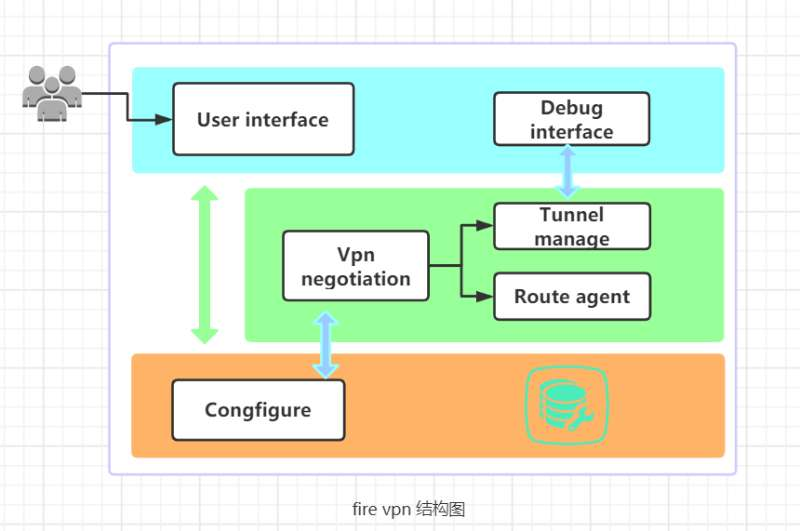

# Fire VPN
Your lightweight VPN - Fire ！

### 开局一张图


### 自我介绍
```
User interface: 用户管理接口, 供用户增删改查vpn配置, 或许是一个vim
Vpn negotation: 外交官, 负责协议交互, 隧道协商
Tunnel manage：负责维护数据隧道, 日常搬运数据包
Route agent：灯塔，指引内网数据包走向最终的归宿
Debug ingerface：隧道管理进程的debug接口
Configure: 懒一点就是.cpp
```

### 目录树
root  
&nbsp;&nbsp;\\_ config: 谁动了我的配置  
&nbsp;&nbsp;\\_ utils: 不出意外只有公共接口会在这里  
&nbsp;&nbsp;\\_ vpn: 一个简单的vpn协议, 协商主逻辑  
&nbsp;&nbsp;\\_ tun: tun口, 一个假想出来的网卡  
&nbsp;&nbsp;\\_ doc: 这里可能会找到一些文档  
   
### 备忘录
1.开启linux的ip代理转发功能,作为路由器角色
	echo 1 > /proc/sys/net/ipv4/ip_forward

2.添加内网路由至tun口
	a.添加路由表
		ip rule add table 17 pref 10
	b.添加路由至某条路由表
		ip route add 14.254.254.0/255.255.255.0 dev tun proto static table 17
	c.可以在tun口抓到内网pc ping 14网段的包了
